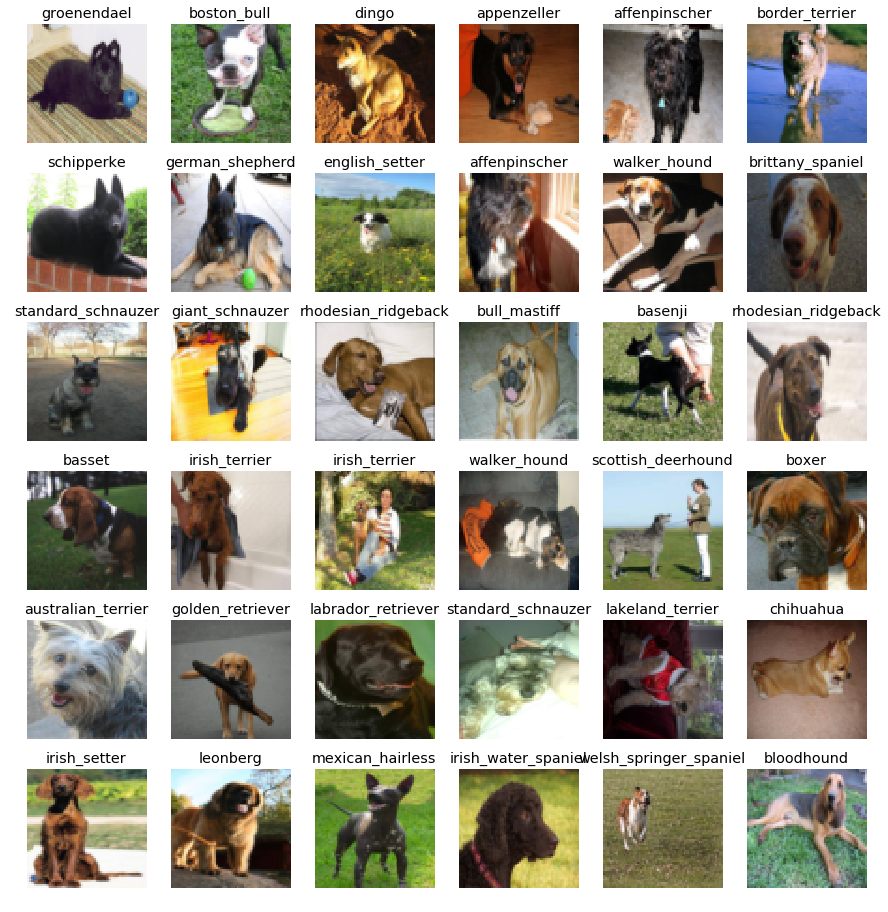

## Generated Dog Breeds Classification
(Obtained and modified from https://github.com/stormy-ua/dog-breeds-classification)

This repo is intended to contain a set of scripts and data for reproducing dog breed classification model training, analysis, and testing on generated dog dataset.

### Prerequisites 

1. Install Python 3.4
2. Install all required python dependencies: `pip install -r requirements.txt`

### Download Data
 

1. `cd` to this repo root directory
2. Execute setup script: `sh ./setup/setup.sh`. In its turn the script executes the following other scripts:
    * Creates all required directories: `sh ./create_dirs.sh`
    * Downloads Google Inception model: `sh ./inception_download.sh`. The link to the frozen TensorFlow model is taken from [here](https://github.com/tensorflow/models/blob/master/tutorials/image/imagenet/classify_image.py#L51)
    * Downloads [Stanford Dogs Dataset](http://vision.stanford.edu/aditya86/ImageNetDogs/): `sh ./download_stanford_dogs_dataset.sh` 

### Prepare Data

1. Convert downloaded Stanford Dogs Dataset to TensorFlow friendly [TFRecords](https://www.tensorflow.org/programmers_guide/datasets#consuming_tfrecord_data) file: `python -m src.data_preparation.stanford_ds_to_tfrecords`

### Train

This section describes how to build dog breed classification dense neural network model on top of the pre-trained by Google deep neural network (namely Inception model).

1. Give a name to the model your are going to train by assigning a name to `CURRENT_MODEL_NAME` variable in [consts.py](src/common/consts.py#L14) script
2. Configure number of layers and number of units in each layer by setting `HEAD_MODEL_LAYERS` variable in [consts.py](src/common/consts.py#L18)
3. Train the model: `python -m src.training.train`. It might take 25-35 minutes depending on the depth of your model and number of epochs (which could be configured in the train.py script itself). TensorBoard could be used to observe the training process: `tensorboard --logdir=./summary`

### Freeze Model

1. Freeze the model: `python -m src.freezing.freeze`. This will bind Inception model with the trained on the previous step "head" model and serialize it as a TensorFlow graph with variables represented as constants. This frozen model will be ready to use for classification tasks.

### Analyze

1. Produce CSV file with predicted vs actual breed. This could be used to analyze precision on the training data e.g. plot a confusion matrix (see [Confusion.ipynb](Confusion.ipynb)). Result CSV file goes to `metrics/training_confusion.csv`: `python -m src.analysis.training_perf_analysis`

2. Generated images are placed in the folders genImages and -1. The generated dataset could be tested by `python -m test-gen-images.py` Result CSV file goes to `test_data.csv`.  See [Confusion_Generated.ipynb](Confusion_Generated.ipynb) to visualize the confusion matrix on the test data.

